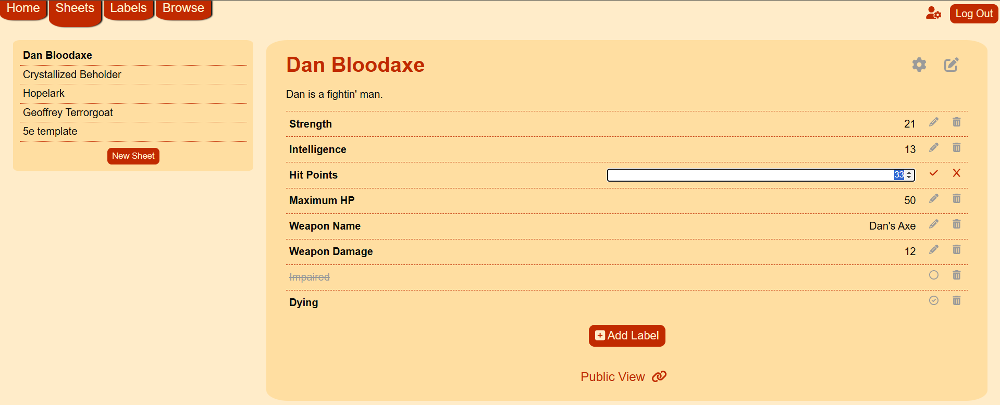
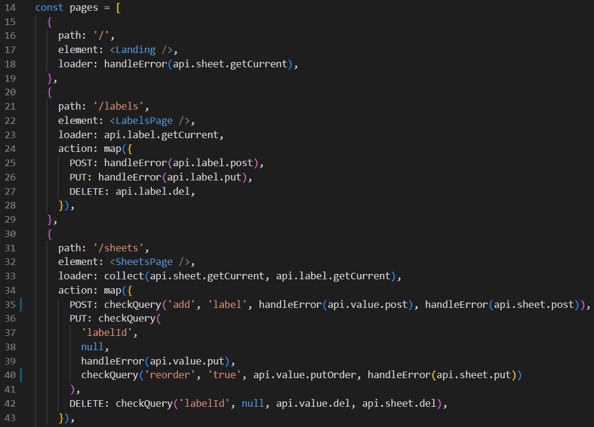

# Tatterpig

Tatterpig is a modular, flexible tabletop RPG character sheet management app designed with Express.js and React.js.

[> Live here! <](https://tatterpig.onrender.com/)

# Functionality

Create and edit _sheets_ to represent characters, monsters, locations, or other game pieces, then create and associate _labels_ with those sheets to represent game stats, hit points, temporary statuses, items, or other game piece information. Reorder, edit, or delete labels from a sheet as suit your needs.

# Technologies

Tatterpig's backend web API is built with [Express](http://expressjs.com/) and uses the [Sequelize](https://sequelize.org/) ORM for database management.

Its frontend is designed with [React](https://react.dev/) and vanilla CSS. A [Redux](https://redux.js.org/) store is used for session management.

# Code Along

To run your own copy of Tatterpig locally, follow these steps:

## Backend Setup

1. `cd` into the `/backend` directory.
1. Run `npm install` to install dependencies.
1. Create a file named `.env` and populate it according to the `.env.example` file, filling in your own `JWT_SECRET`.
1. Run `npm run migrate` to create your database and tables.
1. Run `npm run seed` to populate your database with sample data.
1. Run `npm start` to start listening for API requests.

## Frontend Setup

1. `cd` into the `/frontend` folder.
1. Run `npm install` to install dependencies.
1. Run `npm run dev` to launch the project locally.
1. Open the `localhost` port in your browser (it will default to `localhost:5173` if possible) to view the site!
