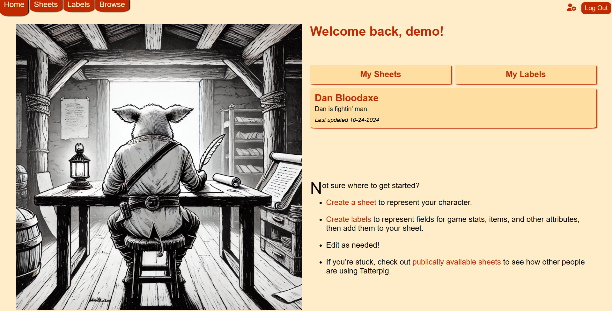
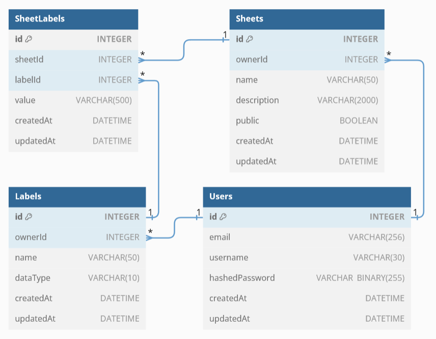
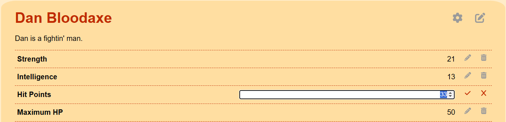

# Tatterpig

Tatterpig is a modular, flexible tabletop RPG character sheet management app designed with Express.js and React.js.



Create and edit **sheets** to represent characters, monsters, locations, or other game pieces, then create and associate **labels** with those sheets to represent game stats, hit points, temporary statuses, items, or other game piece information. Reorder, edit, or delete labels from a sheet as suit your needs.

[**Click here for the live app!**](https://tatterpig.onrender.com/)

## Database



Tatterpig uses [Sequelize](https://sequelize.org/) to access its database and to handle migrations and seeding. It's [configured](backend/config/database.js) for SQLite3 in development and PostgreSQL in production.

Sequelize model validations are one of the pillars of Tatterpig's error handling. As an example, take the `name` column on the [Sheet model](backend/database/models/sheet.js):

```js
{
  name: {
    type: DataTypes.STRING(50),
    allowNull: false,
    validate: {
      len: {
        args: [1, 50],
        msg: 'Name must be 50 or fewer characters',
      },
      notEmpty: {
        args: true,
        msg: 'Name is required',
      },
    },
  },
}
```

If a user attempts to create or update a sheet record with an invalid `name` column, Sequelize will prevent that SQL query and throw a validation error. The appropriate message—either `Name is required` or `Name must be 50 or fewer characters`—is caught by the backend API and ultimately displayed on the frontend.

## Backend API

Tatterpig's JSON-based backend API is built with [Express](http://expressjs.com/). It follows REST conventions; for example, the route to update an existing sheet is `PUT /sheets/:sheetId`. [Read the full API documentation here.](https://github.com/ohalloranjm/tatterpig/wiki/Backend-API)

### User Authentication

Authentication is handled with a JWT, via the [jsonwebtoken](https://www.npmjs.com/package/jsonwebtoken) package. The token is set upon signing up (`POST /users`) or logging in (`POST /session`).

The [`restoreUser` custom middleware](backend/utils/auth.js) assigns a `user` property to the request object. If the JWT is valid, `req.user` is a Sequelize model instance representing the authenticated user; if it's missing or invalid, `req.user` is `null`. This allows any route to quickly reference the authenticated user—for example, [`GET /sheets/current`](backend/routes/api/sheets.js):

```js
const ownerId = req.user.id;
const sheets = await Sheet.findAll({ where: { ownerId } });
```

### Error Handling

Error response bodies are JSON objects with the following fields:

- `title` (string, required)
- `message` (string, required)
- `errors` (object, optional)
- `stack` (string, required, development only)

The raising and handling of errors throughout the Express app is designed to conform to this standard, and in particular to work with the [final error-handling middleware](backend/error-handling.js):

```js
handleErrors.push((err, _req, res, _next) => {
  res.status(err.status || 500);
  console.error(err);
  res.json({
    title: err.title || 'Server Error',
    message: err.message,
    errors: err.errors,
    stack: isProduction ? null : err.stack,
  });
});
```

The [custom `AuthorizationError`](backend/utils/errors.js), for example, is for situations when a user attempts to access a resource without the correct permissions. When a `new AuthorizationError()` is caught by the final handler, the resulting response will have a status code of 403 and the following body:

```json
{
  "title": "Not Authorized",
  "message": "You do not have permission to access this resource"
}
```

For a full catalog of error responses, see the [backend API documentation](https://github.com/ohalloranjm/tatterpig/wiki/Backend-API).

### Response Formatting: SheetLabels Field

Non-error response bodies consist largely of stringified Sequelize model instances. Not much formatting is needed—except when it comes to the `SheetLabels` field on `Sheet` and `Label` instances.

Consider the `GET /sheets/:sheetId` route. Without any formatting, the response body would look something like this (several fields ommitted for concision):

```json
{
  "name": "Kenshin",
  "SheetLabels": [
    {
      "value": "Sword of Slaying",
      "Label": {
        "name": "Primary Weapon",
        "dataType": "string"
      }
    }
  ]
}
```

This is clunky enough to cause headaches for frontend development. The [`formatSheetLabelsMutate` function](backend/utils/response-formatting.js) solves this problem, copying relevant fields from `SheetLabels[i].Label` into `SheetLabels[i]` before deleting the `Label` property entirely. The resulting body is easier on the eyes and on the frontend:

```json
{
  "name": "Kenshin",
  "SheetLabels": [
    {
      "name": "Primary Weapon",
      "dataType": "string",
      "value": "Sword of Slaying"
    }
  ]
}
```

The mirror-image `formatLabelSheetsMutate` function similarly formats `Label` instances with nested `SheetLabels[i].Sheet` properties.

Because these functions mutate the model instance and necessarily disobey the model's structure, an instance passed through either function should _not_ be used in any further Sequelize queries. Ideally, as formatters, these functions should be the very last called before the response is sent.

## Frontend

Tatterpig's frontend is built with [React](https://react.dev/) and vanilla CSS.

### UX Design

The foremost goal is an intuitive, user-friendly interface. To that end, each sheet page contains inline editing (shown below), as well as drag-and-drop functionality for reordering labels.



In addition, all forms utilize one of their inputs' `focus()` or `select()` methods (as appropriate) to eliminate unnecessary mouse clicks. For example, upon opening the edit menu shown above, the existing value of the form (33) is auto-selected, allowing it to be quickly overwritten.

### Router & API

Frontend routing is handled by [React Router](https://reactrouter.com/). A [Redux](https://redux.js.org/) store is used for session management, while all other backend fetches go through React Router's built-in loader/action feature.

The `/sheets` and `/labels` routes are both highly dynamic, with a wide array of user functionality. For ease of use with loaders/actions, these dashboards rely heavily on URL query strings, via the React Router `useSearchParams` hook.

For example, the top-level `/sheets` component [uses the following logic](frontend/src/components/SheetsPage/index.jsx) to determine which sub-components to render:

1. If the URL includes an `id=` query…
   - …and the user owns a sheet with that `id`, render it…
     - …in edit-details mode if the URL has a `edit=true` query.
     - …in normal mode if there is no `edit=true` query.
   - …and the user doesn't own a sheet with that `id`, render the landing/welcome.
2. If the URL query doesn't include `id=` but does include `new=true`, render the form for creating a new sheet.
3. Otherwise, render the landing/welcome.

State change at this level happens via `useNavigate` (or `redirect`, `Link`, etc.).

Similar control flow exists for `useSubmit` actions—aided by [custom functions](frontend/src/api/utils/index.js) for parsing URLs and directing each to the correct API call—as well as for some of the `/sheets` subcomponents.

## Code Along

To run your own copy of Tatterpig locally, follow these steps:

### Backend Setup

1. `cd` into the `/backend` directory.
1. Run `npm install` to install dependencies.
1. Create a file named `.env` and populate it according to the [`.env.example`](backend/.env.example) file, filling in your own `JWT_SECRET`.
1. Run `npm run migrate` to create your database and tables.
1. Run `npm run seed` to populate your database with sample data.
1. Run `npm start` to start listening for API requests.

### Frontend Setup

1. `cd` into the `/frontend` folder.
1. Run `npm install` to install dependencies.
1. Run `npm run dev` to launch the project locally.
1. Open the `localhost` port in your browser (it will default to `localhost:5173` if possible) to view the site!
